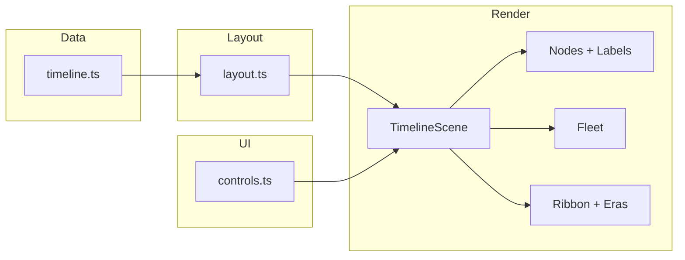

# Galactic Chronology

> *"I've found a complete map to the chronology, no one has ever seen…"*

An interactive **3D timeline of the Star Wars galaxy**, built for people who know the difference between BBY and ABY — and for engineers who appreciate a clean WebGL render loop.

Plot **42+ canon & Legends events** across **25,000 BBY → 35 ABY**: Skywalker saga films, *Andor*, KOTOR, *Outlaws*, deep lore beats, and more. Fly Star Destroyers down the timeline. Click a node. Read the archives.


---

## Why this exists

Star Wars time is messy. Multiple media at the same in-universe year. Ancient history compressed against a dense modern canon. Fandom wikis are thorough but flat.

**Galactic Chronology** puts it in space — literally. Events become glowing nodes on a 3D hyperspace ribbon. Same-year entries stack vertically. Era zones color the void. A patrol fleet of procedural X-wings, TIEs, and ISDs cruises the lanes.

Built to be **explored**, not just read.

---

## Features

### For the lore side of your brain

- **BBY / ABY timeline** — Year 0 ABY is the Battle of Yavin. The calendar resets there; we respect that.
- **42+ curated entries** — Films, series, games, novels, and major lore events from the Dawn of the Jedi through the First Order.
- **Deep lore panels** — Overview, extended lore, canon/Legends tags, and cross-links to connected events.
- **Era focus** — Click *Imperial Era*, *Galactic Civil War*, *High Republic*, etc. to jump the camera there.
- **Same-year stacks** — *Rogue One* and *A New Hope* both at 0 ABY? They share a column, stacked like the galaxy intended (sort of).

### For the engineer side of your brain

- **WebGL + Three.js** — Icosahedron nodes, CSS2D billboard labels, `UnrealBloomPass`, starfield & nebula.
- **Procedural fleet** — Six low-poly ship types, dedicated flight lanes, X-axis patrol with proper forward-facing rotation. No GLTF dependencies.
- **Smart layout** — Logarithmic compression for deep time; horizontal spread for year collisions; vertical stacking for identical years.
- **Zoom-adaptive UX** — Nodes scale down gently when zoomed in; labels fade out when zoomed out. Ships stay in their lanes.
- **TypeScript throughout** — Typed timeline data, scene graph, and UI layer.

---

## Quick start

```bash
git clone https://github.com/matthewgregg/star-wars-timeline.git
cd star-wars-timeline
npm install
npm run dev
```

Open **http://localhost:5173** — the holocron loads automatically.

### Production build

```bash
npm run build
npm run preview
```

---

## Controls

| Input | Action |
|--------|--------|
| **Drag** | Orbit the camera |
| **Scroll** | Zoom in / out |
| **⌘ / Ctrl + Drag** | Strafe (pan without rotating) |
| **Click node** | Open lore panel & fly to event |
| **← / →** | Previous / next event (visual timeline order) |
| **Space** or **▶ Fly** | Auto-fly from newest → oldest |
| **Esc** | Close panel & reset camera |
| **Search** | Query titles, taglines, and lore text |
| **Type filters** | Show/hide films, games, series, etc. |
| **Era chips** (header) | Focus camera on that era |

Default view opens on the **Imperial Era** — because that's where the fun is.

---

## What's on the timeline

| Era | Examples |
|-----|----------|
| **Old Republic** | KOTOR, SWTOR, Great Sith War |
| **High Republic** | *Light of the Jedi*, Starlight Beacon |
| **Fall of the Republic** | Prequels, *Clone Wars*, *Republic Commando* |
| **Imperial Era** | *Fallen Order*, *Andor*, *Rebels*, *Force Unleashed* |
| **Galactic Civil War** | Original trilogy, *Outlaws*, *Dark Forces*, *X-Wing* |
| **New Republic** | *Mandalorian*, *Ahsoka*, *Jedi Knight* |
| **First Order** | Sequel trilogy, *Squadrons* |

Canon and Legends entries are tagged in each panel where applicable.

---

## Architecture

```
src/
├── data/timeline.ts      # Events, eras, BBY/ABY formatting, year → position math
├── scene/
│   ├── TimelineScene.ts  # WebGL renderer, camera, bloom, input, navigation
│   ├── TimelineNode.ts   # Event nodes + CSS2D labels
│   ├── layout.ts         # Collision-aware positioning & zoom scaling
│   ├── Fleet.ts          # Procedural ships & patrol logic
│   └── Starfield.ts      # Ribbon, era zones, starfield
├── ui/controls.ts        # Panels, search, filters, keyboard shortcuts
└── styles/main.css       # HUD / holocron aesthetic
```



### Timeline math (the nerdy bit)

- **Ancient history** (before ~1000 BBY) uses **logarithmic compression** so you don't scroll forever to reach the Prequels.
- **Modern canon** (-1000 BBY → 35 ABY) is **linear-ish** with layout spreading when years collide.
- **Same galactic year** → shared **X column**, **vertical stack**.
- **Ribbon & era shading** match the **actual laid-out bounds** of events, not raw `yearToX()` alone.

---

## Extending the archives

Add an entry in `src/data/timeline.ts`:

```typescript
{
  id: 'my-event',
  title: 'Knights of the Old Republic III',
  year: -3950,
  type: 'game',
  era: 'old-republic',
  lane: 2,
  color: '#ff6b35',
  tagline: 'What could have been',
  description: 'One sentence overview.',
  lore: 'Extended lore for true believers.',
  releaseYear: 20XX,
  connections: ['kotor', 'kotor2'],
  canon: 'legends',
}
```

The layout engine handles positioning. No scene changes required.

---

## Tech stack

| Layer | Choice |
|-------|--------|
| Bundler | [Vite](https://vitejs.dev/) 6 |
| 3D | [Three.js](https://threejs.org/) r170 |
| Language | TypeScript 5 |
| Post-processing | `UnrealBloomPass` |
| Labels | `CSS2DRenderer` |

Zero runtime framework. Just TypeScript, Three.js, and the will of the Force.

---

## Disclaimer

This is a **fan project**. Star Wars and all related properties are © Lucasfilm Ltd. / Disney. Timeline dates draw from publicly available canon and Legends sources; accuracy debates can be conducted in the Mos Eisley cantina.

---

## License

MIT — use it, fork it, add Thrawn's complete chronology if you can figure out where he fits.

*May the Force be with your pull requests.*
